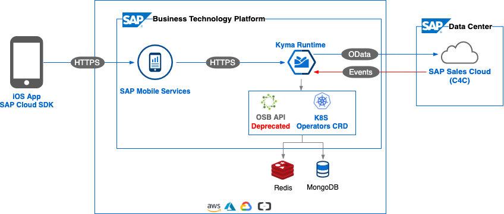
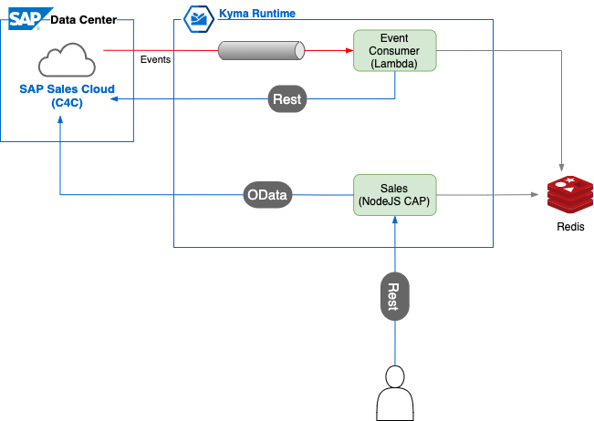
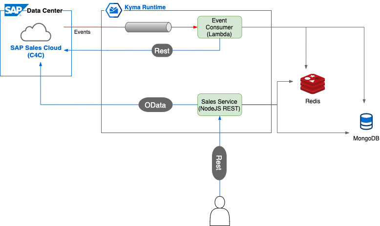

# SAP Sales Cloud Extension
Welcome to the SAP Business Technology Platform "Sales Middleware" use case PoC.

## Description
SAP Sales Middleware, a cloud-based solution, is an extension of SAP Sales Cloud, 
running on the <b>SAP Business Technology Platform</b>. It uses <b>SAP Kyma Runtime</b> and is powered by Kyma serverless functions and event-based communication. 
This repo contains code examples to help you implement a data-driven operating model, providing real-time visibility into sales management, compliance, and productivity.

Sales and marketing processes frequently require customization to the unique business problems facing customers from different industries and regions. Some example processes that might need extending:

* Sales Management
* View of Monthly/Quarterly Sales
* Issue and Escalation Management
* Task and workflow management

## Design Architecture Diagrams
The sales middleware use case runs on SAP Business Technology Platform, Kyma Runtime.

Pictured here is the high-level target design - this includes a mobile application, which is out of scope for this use case, but is included to show the complete process.

  
Below there are two diagrams showing different approaches to extend the functionality of SAP Sales Cloud:

- The Sales Middleware service uses the CAP framework to extend the SAP Sales Cloud API and uses Redis for caching.
  
  
  
- Sales Middleware service communication is built using pure REST calls to SAP Sales Cloud. It also integrates with MongoDB to store some entities for a longer period, and utilizes Redis for temporary caching.

  

## Guidelines

* [Internal Use Case Components](./services).
* [Components Deployments](./deployment)

## Known Issues
No known issues at this moment.

## How to obtain support

[Create an issue](https://github.com/SAP-samples/cloud-extension-sales-middleware/issues) in this repository if you find
a bug or have questions about the content.

## Contributing
In case you want to add some changes then your contributions are welcome in the form of pull requests (PRs) - 
please submit in the normal way. Thank you!

## License
Copyright (c) 2021 SAP SE or an SAP affiliate company. All rights reserved. This project is licensed under the 
Apache Software License, version 2.0 except as noted otherwise in the [LICENSE](LICENSES/Apache-2.0.txt) file.
