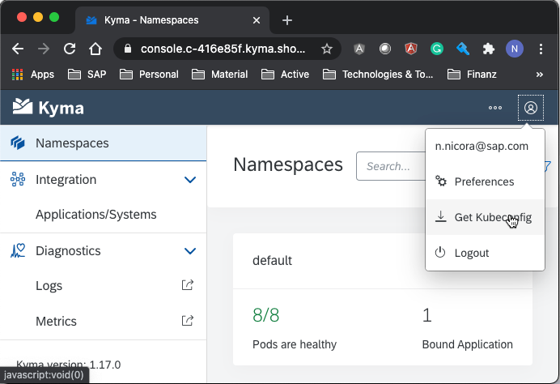

# Kyma & K8S Deployments

- Make sure that you have kubectl available on your machine
- Make sure that KUBECONFIG environment variable is pointing to K8S configuration file, which can be downloaded
  from Kyma Console/Cockpit, see the screenshot <code>Get Kubeconfig</code>:
  
  

### Preparation

For deployment K8S manifest files can be found on sales middleware
[repo](https://github.com/SAP-samples/cloud-extension-sales-middleware/tree/main/deployment).

Clone the repository:
```sh
git clone https://github.com/SAP-samples/cloud-extension-sales-middleware.git

cd cloud-extension-sales-middleware
```

Apply Secrets for Docker Images Repo, will be used to get the images of use case modules.
```sh
cd deployment
kubect apply -f ./prep/
```

### Caching - Redis
There are multiple ways to implement Redis. For production, use the first option below.
<ol>
<li>
Use Azure (Azure Redis Cache) / AWS (ElastiCache for Redis) / GCP (Memorystore for Redis) by creating an instance from Service Catalog - Add-Ons.
Bind created Redis service instance to already existent <code>sales-middleware-cap</code> and <code>c4c-events-consumer</code> 
deployments / k8s apps, see bellow how to deploy the components, using <code>redis_</code> prefix.
</li>

<li>
Temporary in memory (without persistence) only stateful service Redis on K8S cluster

```sh
helm repo add bitnami https://charts.bitnami.com/bitnami
helm repo update
helm install bitnami/redis --values statefull/values-redis.yaml --namespace default --name-template redis
```
</li>
</ol>

### Database - MongoDB
There are multiple ways to implement MongoDB. For production, use the first option below.
<ol>
<li>
Use Azure (Azure CosmosDB) by creating an instance of from Service Catalog - Add-Ons.
Bind created MongoDB service instance to already existent <code>sales-middleware-rest</code> 
deployments / k8s apps, see below how to deploy the components, using <code>mongodb_</code> prefix.
</li>

<li>
Temporary in memory (without persistence) only stateful service MongoDB on K8S cluster

```sh
helm repo add bitnami https://charts.bitnami.com/bitnami
helm repo update
helm install bitnami/mongodb --values statefull/values-mongodb.yaml --namespace default --name-template mongodb
```
</li>
</ol>


### Services
Modify the content of file <code>101-sales-middleware-conf.yaml</code> by replacing the following:
```sh
  <Your Sales Cloud Host Name> - Replace with SAP Sales Cloud domain instance name
  <Your Sales Cloud Username> - Replace with SAP Sales Cloud technical username 
  <Your Sales Cloud Password> - Replace with SAP Sales Cloud technical user password 
```
Install K8S <code>sales middleware</code> service.

```sh
kubect apply -f ./100-sales-middleware-sec.yaml
kubect apply -f ./101-sales-middleware-conf.yaml
```

For service <code>c4c-events-consumer</code> function consuming SAP Sales Cloud services.
```sh
kubect apply -f ./200-c4c-events-consumer-sec.yaml

# When redis is installed as stateful service, use for development.
kubect apply -f ./201-c4c-events-consumer-statefull-redis-rc.yaml

# When redis will be bind-ed to app, from BTP, must be used for production.
kubect apply -f ./use-binding-services/201-c4c-events-consumer-rc.yaml

kubect apply -f ./202-c4c-events-consumer-svc.yaml
```

For service <code>sales-middleware-cap</code> using CAP framework to extend SAP Sales Cloud (C4C) API
```sh

# When redis is installed as stateful service, use for development.
kubect apply -f ./102-sales-middleware-cap-statefull-redis-rc.yaml

# When redis will be bound to app, using BTP. Must be used for production.
kubect apply -f ./use-binding-services/102-sales-middleware-cap-rc.yaml

kubect apply -f ./103-sales-middleware-cap-svc.yaml
```

For service <code>sales-middleware-rest</code> using pure rest to query Sales Cloud(C4C) API
```sh

# When redis is installed as stateful service use this:
kubect apply -f ./102-sales-middleware-rest-statefull-redis-rc.yaml

# When redis will be bound to app using BTP:
kubect apply -f ./use-binding-services/102-sales-middleware-rest-rc.yaml

kubect apply -f ./103-sales-middleware-rest-svc.yaml
```
