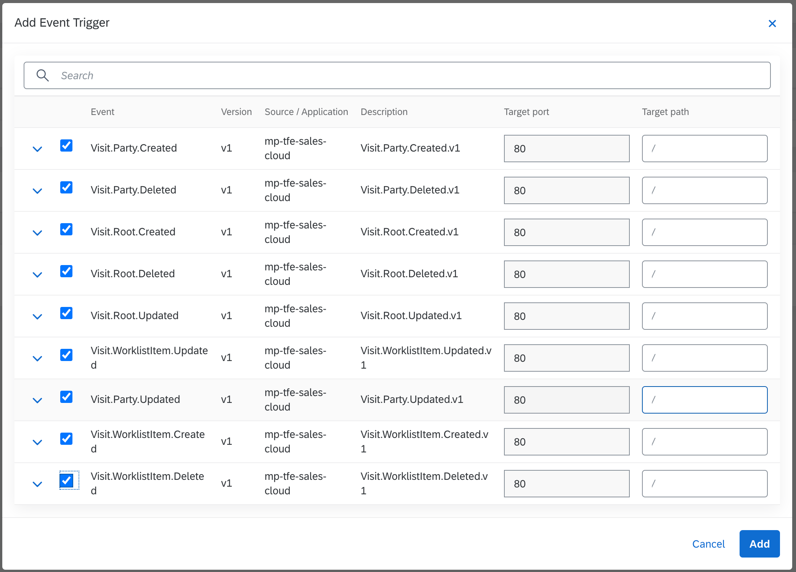

## Use Case Application Services
Here you can find the implementation services for the sales middleware use case.

### Enablement of Kyma Runtime

Prerequisite on Business Technology Platform is the Kyma Runtime. As the entire uses case is based on Kyma,
make sure that it is enabled on your BTP sub-account, or in the trial landscape.
User should be an administrator on BTP for the Global Account where changes are taking place.
An SAP Sales Cloud tenant is required as well.


### Enablement of Sales Cloud (C4C) on SAP Business Technology Platform
These are the step to set up Sales Cloud/Cloud for Customer catalog service on BTP.

On SAP Business Technology Platform Cockpit under global account.

- Select <code>System Landscape -> Systems</code>; Click the <code>Register System</code> button;
  

- Click the <code>Register</code> button. After registering a new record will come up in <code>Pending</code> status.
  

- Select <code>System Landscape -> Formations</code>; Click the <code>Create Formation</code> button;
  

### Setup Sales Cloud (C4C) System

Login into Sales Cloud/Sales for Customer(C4C) portal using admin user and password,
by using a similar URL <i>https://myXXXXXX.crm.ondemand.com </i>.

<u>Navigate under <code>Administrator -> General Settings -> Communication Systems</code>.</u>


On the opened tab <code>All Communication Systems</code> click the <code>New</code> button from top right.
On the new form introduce all required information about the system including the ID of the system.
For the current example, we gave the ID <code>US_SALES_MIDDLEWARE_DEMO</code>.
The value for Host Name field should be the Kyma host URL(for instance <i>https://gateway.XXc2fb6.kyma.shoot.live.k8s-hana.ondemand.com</i>)


System is in <code>In Preparation</code> state/status. The target is to be in the <code>Active</code> state/status.
Select the system record and activate it by clicking the <code>Actions -> Set to Active</code>


---

<u>Navigate under <code>Administrator -> General Settings -> Communication Arrangements</code></u>


On the opened tab <code>All Communication Arrangements</code> click the <code>New</code> button from the top right. A dialog will be opened.

- Select from <code>Communication Scenarios</code>, the <code>OData Services for Business Objects</code> record.
- Click the button <code>Next</code> from the bottom right.
- Select created by you yearly system for this example <code>US_SALES_MIDDLEWARE_DEMO</code> on <code>System Instance ID</code>.
- Click the button <code>Next</code> from the bottom right.
- Select best fit <code>Authentication Method</code>; I selected <code>User ID and Password</code>.
  The <code>User ID</code> is autogenerated as <code>_US_SALES__0</code> can be changed. Also specify the password by clicking the <code>Edit Credentials</code> button as we will need them later on.
  Select <code>Services Used</code> as fitting to your use case (selected are <code>activity, activityplanprocessing, contact</code>).
- Click the button <code>Next</code> from the bottom right.
- Review and click the button <code>Finish</code> from the bottom right.

Now you should be able to see the created arrangements on the list.

    
---

<u>Navigate under <code>Administrator -> General Settings -> Event Notification</code></u>


On the opened tab under <code>All Consumers</code> click the <code>Add</code> button from the top right.

- For the field <code>Type</code> select <code>SAP Cloud Platform Extensions</code>. Give a convinient for you name, used <code>SALES_MIDDLEWARE_DEMO_KYMA</code>.
- For the field <code>Remote Environment URL</code> go to SCP Cockpit and take the token url. Copy the generated url token by click the key on registered early by you system.
  
  
- For the field <code>Callback User</code> take the user that was autogenerated or specified by you, in our case is <code>_US_SALES__0</code>.
- For the field <code>Callback Password</code> take the password that was specified by you for user <code>_US_SALES__0</code>, or of course your specified user.
- Click the button <code>Save</code> from bottom right.

- Click new created consumer record <code>SALES_MIDDLEWARE_DEMO_KYMA</code> and activate it by clicking <code>Actions -> Activate</code>;
  State should change from <code>Inactive -> Active</code>


- Select consumer record <code>SALES_MIDDLEWARE_DEMO_KYMA</code> and add subscriptions on the <code>Subscriptions</code> dialog and click the button <code>Add</code>.
  On pop-up dialog configure event subscription for which you are interested into to receive events on BTP Kyma Message broker or Cloud Foundry:
    - As <code>Business Object</code> select <code>Visit</code>
    - As <code>Node</code> select <code>Party</code>
    - Enable <code>Created, Updated, Deleted, Enhanced Payload</code>
    - Click the button <code>Save</code>
      Keep adding as much as you consider the subscription for which you want to receive events.

  

After these steps on SCP <code>System Landscape -> Systems</code>, the registered system should be in <code>Registered</code> state.


    
---

### Kyma Runtime Cockpit Operations

On Kyma Console/Cockpit click on <code>Applications/Systems</code>, your should be able to see integrated early created
system under name <code>mp-sap-cloud-for-customer-test</code>, and in state/status <code>SERVING</code>.


<br/>Details should look like:


<br/>Bind this system to a specific K8S namespace by clicking <code>+ Create Binding</code>.

Navigating to selected namespace into <code>Service Management -> Catalog</code>. You should be able to see the service.


Details of created service:


Provision the Service Class in the selected (example is using <code>default</code>) Namespace, by clicking the <code>+ Add</code> button,
and give an more friendly name.


---

Create a basic function using Kyma console <code>Development -> Functions</code>, giving a name <code>c4c-consumers-events</code>.

```javascript
module.exports = { 
   main: async function (event, context) {
    console.log("C4C event: %s", JSON.stringify(event.data));
    return 1;
  }
}
```
After saving make sure that final status is <code>Running</code>.

---

Now it is time to add triggers for events.
Using Kyma Console/Cockpit <code>“Operations -> Services”</code>.
Select <code>“c4c-consumers-events”</code> service. Click on the button <code>“+ Add Event Trigger”</code>,
select events for which you want that function to be triggered.



See logs of function using Kyma Console/Cockpit or command line

```shell
kubectl logs -f <name of function pod> function
```

On pod console logs, you should see messages with JSON like this:
```json
{
    "Changes": [
      {
         "ChangedBy": "SAP_SYSTEM",
         "ChangedFields": [
            {
               "Fieldname": "SystemAdministrativeData/LastChangeDateTime",
               "New": "2021-01-14T18:16:37.2393220Z",
               "Old": "2021-01-14T18:16:34.5940290Z"
            },
            {
               "Fieldname": "VisitWorkItemGenerationCode",
               "New": "3",
               "Old": "1"
            },
            {
               "Fieldname": "ChangeSource",
               "New": "JOB 20210114181637 ",
               "Old": ""
            }
         ],
         "Modification": "Updated",
         "ParentNodeID": "",
         "node": "Visit",
         "nodeID": "00163EAE7FFD1EEB95D282AD02F115EC"
      }
    ],
    "entity-id": "00163EAE7FFD1EEB95D282AD02F115EC",
    "root-entity-id": "00163EAE7FFD1EEB95D282AD02F115EC"
}
```

---

To have calls from Kyma Function toward
[SAP Sales Cloud OData API]("https://help.sap.com/viewer/1364b70b9cbb417ea5e2d80e966d4f49/2002/en-US/6c0a463cc9ca450cbd01a9a5057ce682.html").
make sure that exist a service binding usage of your services <code>c4c-consumers-events</code>
under created service instance <code>mp-sap-cloud-for-customer-test-pesky-bug</code>.

```shell
CONFIGURATION={"credentials":{"password":"....","username":"...."},"csrfConfig":{"tokenUrl":"https://myXXXXXX.crm.ondemand.com/sap/c4c/odata/v1/c4codataapi/"}}
CREDENTIALS_TYPE=basicauth
SAP_SALES_CLOUD_741C964E_854F_482E_A391_5A036C2403A9_GATEWAY_URL=http://default-gateway:8080/secret/c4c-sales-middleware-binding/api/SAP_SALES_CLOUD_741C964E_854F_482E_A391_5A036C2403A9
SAP_SALES_CLOUD_741C964E_854F_482E_A391_5A036C2403A9_TARGET_URL=https://myXXXXXX.crm.ondemand.com/sap/c4c/odata/v1/c4codataapi

```
This enables you to easily call the OData API from C4C without worrying about authentication.

First, open the <code>Dependencies</code> tab and add:
```json
"dependencies": {
    "axios": "0.19.0"
}
```

Then go back to the <code>Source</code> tab and start with
```javascript
const axios = require("axios");
const baseURL = `${process.env['SAP_SALES_CLOUD_***_GATEWAY_URL']}`; // this is where you need your GATEWAY_URL
```

Afterward, replace the previous Kyma Function code with the following to catch the address of the account and post it to the logs:

```javascript
module.exports = {
  main: async function (event, context) {
      // Get the accountId from the event payload 
      var accountId = event.data["entity-id"];
      console.log(`Account ID from Event: ${accountId}`);

      try {

        // read city from C4C
        var response = await axios({
          method: 'get',
            url: `${baseURL}/CorporateAccountCollection('${accountId}')`,
            params: {
              '$select': 'CurrentDefaultAddressUUID,City'
            }
        })
        corporateCity = response.data.d.results;
        console.log("Corporate City:")
        console.log(corporateCity);
        
      } catch (error) {
        console.log("Error:")
        console.log(error);
        event.extensions.response.status(500).send("Error");
      }
    }
}
```

---

Go to Cloud for Customer web page and do some operation on registered subscription business objects.

After pod console logs you should see messages.

### Deployments of apps on Kyma/K8S 
[Deployment Guidelines](../deployment)

### Components
- [c4c-events-consumer](c4c-events-consumer)
- [sales-middleware](sales-cap)

### Dependencies
- [Kyma](https://kyma-project.io)
- [Sales for Customer(C4C)](https://gdm-public-2020-emea.demo.hybris.com/gdm-cockpit/)
- [Redis](#)

