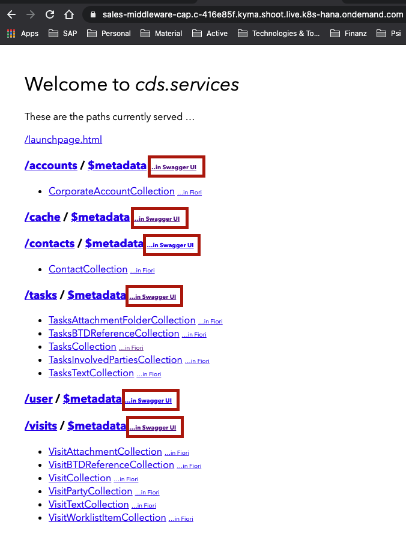

# Sales Service
Service using CAP framework on top of [SAP Sales Cloud (C4C)](https://api.sap.com/package/C4C?section=Artifacts) API's.
Service is using Redis to cache most used data to reduce number of requests to C4C API,
clients of this service using to re-read same data multiple time.

Swagger API is exposed under service host:




Local Running - Debugging.

- Download *EDMX* for each one:
  - https://api.sap.com/api/activity/overview
  - https://api.sap.com/api/contact/overview
  - https://api.sap.com/api/identity/overview
  - https://api.sap.com/api/businessuser/overview

    Download *EDMX* file by clicking <b>Download API Specification</b> button,
- Execute on terminal being in *sales* folder
  ```bash
  cds import <path to downloaded file>/activity.edmx
  cds import <path to downloaded file>/contact.edmx
  cds import <path to downloaded file>/identity.edmx
  cds import <path to downloaded file>/businessuser.edmx
  
  #Start Redis Cache
  docker-compose up -d
  
  npm i -g @sap/cds-dk
  npm add sqlite3 -D
  
  npm install
  
  cds watch
  ```

### CAP Remarks

* Exposed endpoints is using ODataV4 based on CAP
* CAP CDS Entities integration problems with External Services exposing API ODataV2, 
  requiring creation of custom entity converters. Excluding extra fields; Convert Date & Time fields; 
